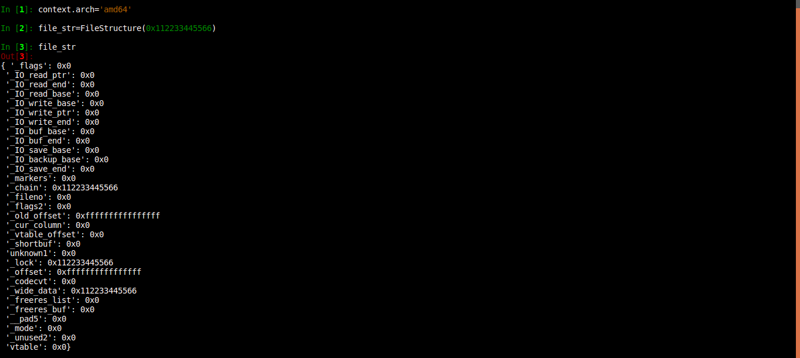

# File Structure Exploitation

This python module is for generating payloads to exploit the FILE structure in C. Can be used in CTF challenges.

## Install

This can either be used independently or be used with `pwntools`. To use independently, just place the script in the same directory as your exploit script and add `from FilePointer import *` in the exploit script.

I have also sent a PR to merge this with pwntools, but till it's merged, you can add it to pwntools locally by either manually placing the python file in the `pwnlib` directory of your python packages and adding `from pwnlib.FilePointer import *` in `pwn/toplevel.py` file in your python packages directory.

The `install.py` script will automatically do this for you. Just run `python install.py` with root permissions. Yeah, I know the script is pretty ugly and I should have probably used a bash script, but I like python better!

If you place the script in the pwntools directory or just install it via the `install.py` script,  then a `from pwn import *` will let you access this class and it's functions. Enjoy!

## Usage

* **FileStructure(null)** - returns an object that can stimulate the FILE structure in C

  1. null - an address pointing to null value

* **write(addr,size)** - function in FileStructure. Returns payload for writing data from arbitrary address to stdout. Arguments are-

  1. addr - the address from where the data is to be written out
  1. size - the size of data to be written

* **read(addr,size)** - function in FileStructure. Returns payload for reading data to arbitrary address from stdin. Arguments are-

  1. addr - the address where the data is to be read
  1. size - the size of data to be read

* **str(object)** - generate payload from the object of FileStructure.

* **struntil(memberVariable)** - generate the payload only upto the specified variable. For eg. struntil('fileno') will generate the payload only uptill fileno. All further variable's are ignored.

* **orange(io\_list\_all, vtable)** - returns a payload for [House of Orange](http://4ngelboy.blogspot.com/2016/10/hitcon-ctf-qual-2016-house-of-orange.html) exploit (for libc's < 2.24).

  1. io\_list\_all - address of \_IO\_list\_all
  2. vtable - address of the fake vtable

**Note -** Set the architecture from `context.arch`. Currently only `i386` and `amd64` architectures have been implemented.

## Examples

Generate the payload with str()

Get the len of the payload

See [PoC](PoC/) for full detailed usage examples

## Credits

Angelboy (@scwuaptx) and his slide's on File Structures - [Play with FILE Structure](http://4ngelboy.blogspot.in/2017/11/play-with-file-structure-yet-another.html)
